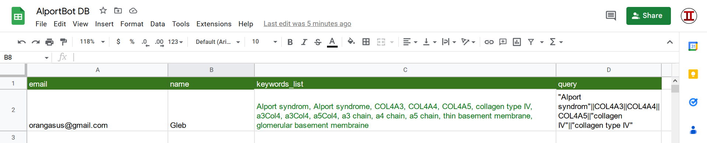
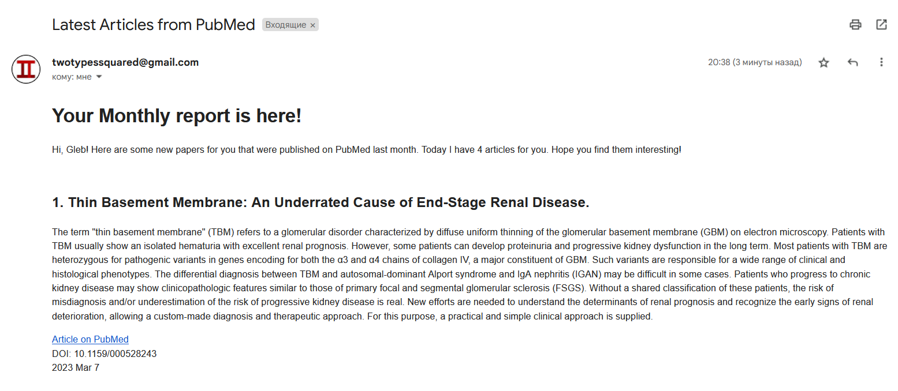
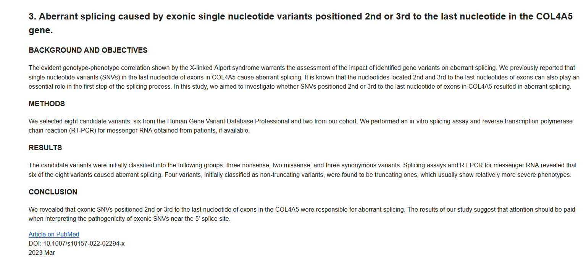

# Alport Bot

## What does it do?
Alport bot is a script that parses [PubMed](https://pubmed.ncbi.nlm.nih.gov/) for new articles that were published there this month and then sends user a monthly report about all the wonderful things it found. It sends this report at the end of each month

 _PubMed is a free resource supporting the search and retrieval of biomedical and life sciences literature with the aim of improving health–both globally and personally_ - from official website.  

## How does this work?
- Step 1   Bot gets user query and keywords from a Google sheet that has 4 fields: email adress, user's name, list of keywords and search query

- Step 2   It searches PubMed DB using these query and keywords with Entrez API tools

- Step 3   Bot retrieves and formats data about each article: title, abstract, pub date, keywords, DOI

- Step 4   It forms a report for user and sends it to his email adress. It contains all information about each article the user might need in order to understand if he is interested in this paper or not
  
## About searching in PubMed DB
Just hear me out. Despite Entrez API being rather easy to use, it has a significant flaw - it's not entirely accurate. That's why after the bot receives articles from a search in PubMed DB (it needs the query paremeter for this) it checks if any of given keywords are presented in article keywords. This way Alport Bot can minimize chances of sending unrelated articles to the user, though it unfortunately can happen.  

## Who can use this?
This program can be a lot of help to researchers and scientist in field of medicine and biology. It allows users to stay on top of things when it comes to a specific topic without wasting time on searching for new articles.  

## Exmaple
Here is an example of data storage

  

And here is what the report looks like

  

## What can be improved in the future?
- Add updating ones preferences and subsrcibing via email
- Create some kind of a manual for users on how to choose keywords and write perfect search queries
- Improve visual part of the reports
- Migrate to an actual database
  

## Technology Stack
- __Entrez API + A bit of BioPython__ for searching PubMed DB
- __Jinja2__ for creating html email template
- A very little of __Pandas__ for retrieving data from Google Sheets
- __Google Drive and Google Sheets APIs__ for working with Google Sheets
- __SSL, SMTP and email Python modules__ for sending emails